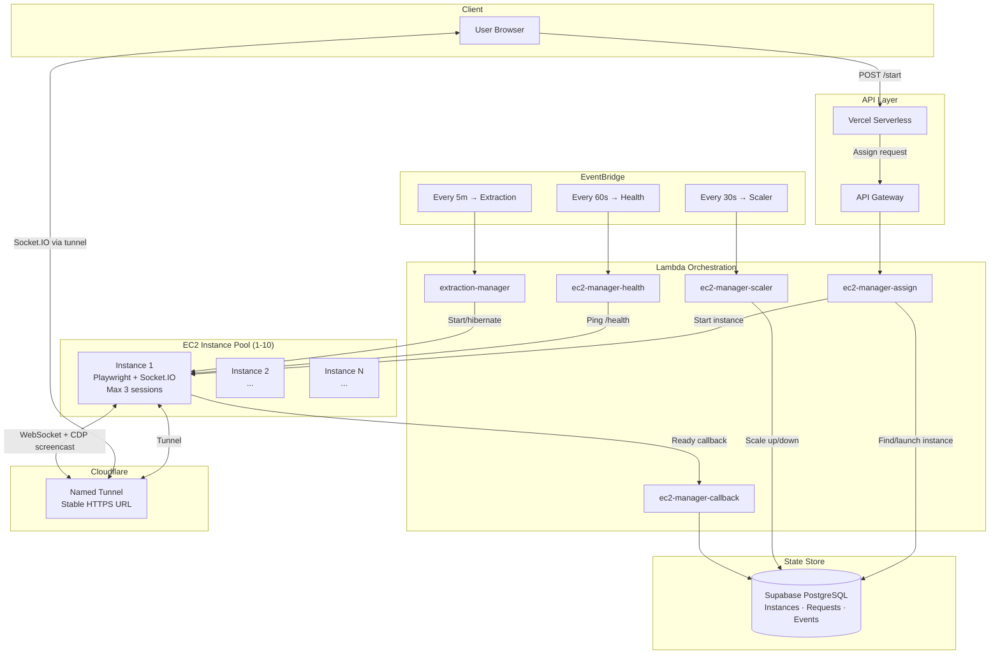

# aws-infra

Auto-scaling AWS infrastructure for browser-based authentication and web scraping. Manages a pool of EC2 instances running headless browsers, with Lambda-based orchestration, Cloudflare tunnel integration, and real-time screencast streaming via Socket.IO.

**URL-agnostic** — configure for any target site, not just one.

## Architecture



## How It Works

### Authentication Flow

1. **User requests login** → `POST /api/streaming-auth/start`
2. **Assign Lambda** finds a warm instance with capacity, or resumes a hibernated one, or launches new
3. User gets a **tunnel URL** pointing to an EC2 instance running Playwright
4. Instance streams a **real-time screencast** (CDP → JPEG frames → Socket.IO → browser canvas)
5. User interacts with the remote browser (mouse/keyboard events forwarded via WebSocket)
6. On login detection, **cookies are extracted** and the session closes
7. Instance stays warm for the next user

### Instance Lifecycle

```
                    ┌──────────┐
          launch →  │ STARTING │ ← resume from hibernation
                    └────┬─────┘
                         │ callback received
                         ▼
                    ┌──────────┐
                    │   WARM   │ ◄─── available for new sessions
                    └────┬─────┘
                         │ session assigned
                         ▼
                    ┌──────────┐
                    │  ACTIVE  │ ◄─── 1-3 concurrent sessions
                    └────┬─────┘
                         │ all sessions end
                         ▼
                    ┌──────────┐
           idle →   │   WARM   │
        timeout     └────┬─────┘
                         │ 5 min idle
                         ▼
                 ┌──────────────┐
                 │ HIBERNATING  │ ← EC2 hibernate (3x faster resume)
                 └──────┬───────┘
                        │ 1 hour timeout
                        ▼
                 ┌──────────────┐
                 │  TERMINATED  │
                 └──────────────┘
```

### Scaling Strategy

| Condition | Action |
|-----------|--------|
| 2+ users queued | **Burst scale**: resume hibernated or launch new instance |
| Instance idle > 5 min | **Hibernate** (keep warm pool minimum) |
| Hibernated > 1 hour | **Terminate** |
| Health check fails 3x | **Terminate** and release sessions |
| Warm pool below minimum | **Resume** hibernated or **launch** new |

**Capacity**: 10 instances × 3 sessions = **30 concurrent users**

## Technical Highlights

- **Lambda-based auto-scaling** — 5 Lambda functions orchestrate a pool of 1-10 EC2 instances, triggered by EventBridge rules every 30-60 seconds
- **EC2 hibernation** — Instances hibernate instead of stopping, reducing resume time from ~90s (cold start) to ~30s
- **CDP screencast streaming** — Chrome DevTools Protocol captures browser frames as JPEG, streamed via Socket.IO at configurable quality/FPS
- **Multi-session isolation** — Each user gets an isolated Playwright browser context (separate cookies, storage, cache) — up to 3 per instance
- **Cloudflare tunnel integration** — Named tunnels provide stable HTTPS URLs without opening inbound ports; quick tunnel fallback for development
- **Supabase RPC for atomic state** — PostgreSQL RPC functions (`assign_request_to_instance`, `release_instance_session`) prevent race conditions in concurrent Lambda invocations
- **Request queueing** — When all instances are at capacity, requests queue with position tracking and estimated wait times
- **Extraction manager** — Separate Lambda manages an on-demand extraction instance: auto-starts when work is queued, hibernates when idle, triggers extraction via SSM Run Command

## Project Structure

```
aws-infra/
├── lambda/                        # AWS Lambda functions
│   ├── shared/                    # Shared config, EC2 ops, state store
│   │   ├── config.js              # Scaling params, timeouts, AWS config
│   │   ├── ec2-ops.js             # EC2 SDK: launch, start, stop, terminate
│   │   └── state-store.js         # Supabase state management (20+ functions)
│   ├── ec2-manager-assign/        # Assign auth requests to instances
│   ├── ec2-manager-scaler/        # Auto-scale pool (EventBridge 30s)
│   ├── ec2-manager-health/        # Health monitoring (EventBridge 60s)
│   ├── ec2-manager-callback/      # Instance ready notifications
│   └── extraction-manager/        # Extraction instance lifecycle
├── ec2/                           # EC2 instance scripts
│   ├── startup.sh                 # User data: tunnel + server + register
│   └── register-instance.js       # Instance self-registration
├── streaming-server/              # Socket.IO + Playwright auth server
│   └── server.js                  # Multi-session streaming server
├── extractors/                    # Content extraction plugins
│   ├── base-extractor.js          # Extractor interface
│   └── examples/canvas/           # Canvas LMS extractors (reference)
├── api/streaming-auth/            # API route handlers
│   ├── start.js                   # Start auth session
│   └── viewer.js                  # Streaming viewer HTML
├── config/
│   └── site.js                    # URL-agnostic site configuration
├── infra/                         # Infrastructure documentation
│   ├── supabase-schema.sql        # Database tables + RPC functions
│   ├── eventbridge-rules.json     # EventBridge rule definitions
│   └── iam-policies.json          # IAM policy templates
├── scripts/
│   ├── deploy-lambdas.sh          # Deploy all Lambda functions
│   └── deploy-streaming.sh        # Deploy streaming server to EC2
├── .env.example                   # All environment variables documented
└── package.json
```

## Configuration

### URL-Agnostic Setup

This infrastructure works with **any website** that requires browser-based authentication. Configure via environment variables:

```bash
# What site to authenticate against
TARGET_URL=https://your-app.example.com
TARGET_NAME=YourApp

# How to detect successful login (comma-separated URL path patterns)
LOGIN_SUCCESS_PATTERNS=/dashboard,/home,/app
LOGIN_EXCLUDE_PATTERNS=/login,/auth,/sso,/oauth

# Optional: navigate to a profile page after login to extract username
POST_LOGIN_URL=https://your-app.example.com/settings/profile
USERNAME_SELECTORS=#username-display,.user-name,input[name="username"]
```

The streaming server uses these patterns to detect when the user has successfully authenticated, then extracts all browser cookies for the target domain.

### Custom Extractors

Write content extractors by extending `BaseExtractor`:

```javascript
const BaseExtractor = require("../base-extractor");

class MyExtractor extends BaseExtractor {
  get entityType() { return "article"; }

  canHandle(url) {
    return url.includes("/articles/");
  }

  async extract(page, url) {
    return await page.evaluate(() => ({
      title: document.querySelector("h1")?.textContent,
      content: document.querySelector(".article-body")?.innerHTML,
    }));
  }
}
```

See `extractors/examples/canvas/` for working reference implementations.

## Deployment

### Prerequisites

- AWS account with EC2, Lambda, EventBridge, and IAM access
- Custom EC2 AMI with Node.js, Playwright, Chromium, and cloudflared pre-installed
- Supabase project (or any PostgreSQL with the schema from `infra/supabase-schema.sql`)
- Cloudflare account (optional, for named tunnels)

### 1. Database Setup

Apply the schema to your Supabase project:

```bash
psql $DATABASE_URL < infra/supabase-schema.sql
```

### 2. Deploy Lambda Functions

```bash
# Set environment variables for each Lambda (via AWS Console or CLI)
# Then deploy:
bash scripts/deploy-lambdas.sh
```

### 3. Configure EventBridge Rules

Create the three scheduled rules defined in `infra/eventbridge-rules.json`:
- `ec2-manager-scaler`: rate(30 seconds)
- `ec2-manager-health`: rate(1 minute)
- `extraction-manager`: rate(5 minutes)

### 4. Prepare EC2 AMI

Build a custom AMI with:
- Node.js 18+
- Playwright + Chromium (`npx playwright install chromium`)
- cloudflared
- PM2 (`npm install -g pm2`)

### 5. Deploy Streaming Server

```bash
bash scripts/deploy-streaming.sh <instance-id> <path-to-key.pem>
```

## Cost Optimization

| Component | Cost | Notes |
|-----------|------|-------|
| EC2 t3.small (warm pool) | ~$15/mo | 1 instance always warm |
| EC2 t3.small (burst) | ~$0-30/mo | On-demand, hibernated when idle |
| Lambda (5 functions) | ~$2/mo | ~86k invocations/month from EventBridge |
| Supabase | Free tier | Sufficient for state management |
| Cloudflare tunnel | Free | Named tunnels included in free plan |
| **Total** | **~$17-47/mo** | Scales to 30 concurrent users |

Key cost optimizations:
- **Hibernation over termination**: 3x faster resume, no re-provisioning cost
- **Burst scaling**: Only spins up extra instances when 2+ users are waiting
- **Auto-shutdown**: Idle instances hibernate after 5 min, terminate after 1 hour
- **EventBridge pricing**: rate(30 seconds) costs pennies compared to polling

## License

MIT
