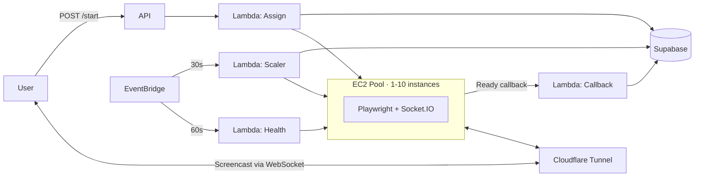

# browser-fleet

Infrastructure for browser-based authentication and web scraping. Manages a pool of EC2 instances running headless browsers, with Lambda-based orchestration, Cloudflare tunnel integration, and real-time screencast streaming via Socket.IO with low latency.

## Architecture



## How It Works

### Authentication Flow

1. **User requests login** → `POST /api/streaming-auth/start`
2. **Assign Lambda** finds a warm instance with capacity, or resumes a hibernated one, or launches new
3. User gets a **tunnel URL** pointing to an EC2 instance running Playwright
4. Instance streams a **real-time screencast** (CDP → JPEG frames → Socket.IO → browser canvas)
5. User interacts with the remote browser (mouse/keyboard events forwarded via WebSocket)
6. On login detection, **cookies are extracted** and the session closes
7. Instance stays warm for the next user

### Instance Lifecycle

```
                    ┌──────────┐
          launch →  │ STARTING │ ← resume from hibernation
                    └────┬─────┘
                         │ callback received
                         ▼
                    ┌──────────┐
                    │   WARM   │ ◄─── available for new sessions
                    └────┬─────┘
                         │ session assigned
                         ▼
                    ┌──────────┐
                    │  ACTIVE  │ ◄─── 1-3 concurrent sessions
                    └────┬─────┘
                         │ all sessions end
                         ▼
                    ┌──────────┐
           idle →   │   WARM   │
        timeout     └────┬─────┘
                         │ 5 min idle
                         ▼
                 ┌──────────────┐
                 │ HIBERNATING  │ ← EC2 hibernate (3x faster resume)
                 └──────┬───────┘
                        │ 1 hour timeout
                        ▼
                 ┌──────────────┐
                 │  TERMINATED  │
                 └──────────────┘
```

### Scaling Strategy

| Condition | Action |
|-----------|--------|
| 2+ users queued | **Burst scale**: resume hibernated or launch new instance |
| Instance idle > 5 min | **Hibernate** (keep warm pool minimum) |
| Hibernated > 1 hour | **Terminate** |
| Health check fails 3x | **Terminate** and release sessions |
| Warm pool below minimum | **Resume** hibernated or **launch** new |

**Capacity**: 10 instances × 3 sessions = **30 concurrent users**

## Key Features

- **Lambda-based auto-scaling** — 5 Lambda functions orchestrate a pool of 1-10 EC2 instances, triggered by EventBridge rules every 30-60 seconds
- **EC2 hibernation** — Instances hibernate instead of stopping, reducing resume time from ~90s (cold start) to ~30s
- **CDP screencast streaming** — Chrome DevTools Protocol captures browser frames as JPEG, streamed via Socket.IO at configurable quality/FPS
- **Multi-session isolation** — Each user gets an isolated Playwright browser context (separate cookies, storage, cache) — up to 3 per instance
- **Cloudflare tunnel integration** — Named tunnels provide stable HTTPS URLs without opening inbound ports; quick tunnel fallback for development
- **Supabase RPC for atomic state** — PostgreSQL RPC functions (`assign_request_to_instance`, `release_instance_session`) prevent race conditions in concurrent Lambda invocations
- **Request queueing** — When all instances are at capacity, requests queue with position tracking and estimated wait times
- **Extraction manager** — Separate Lambda manages an on-demand extraction instance: auto-starts when work is queued, hibernates when idle, triggers extraction via SSM Run Command


### Custom Extractors

The streaming server detects when the user has successfully authenticated, then extracts all browser cookies for the target domain.

Write content extractors by extending `BaseExtractor`:

```javascript
const BaseExtractor = require("../base-extractor");

class MyExtractor extends BaseExtractor {
  get entityType() { return "article"; }

  canHandle(url) {
    return url.includes("/articles/");
  }

  async extract(page, url) {
    return await page.evaluate(() => ({
      title: document.querySelector("h1")?.textContent,
      content: document.querySelector(".article-body")?.innerHTML,
    }));
  }
}
```

See `extractors/examples/canvas/` for working reference implementations.

## Deployment

### 1. Database Setup

Apply the schema to your Supabase project:

```bash
psql $DATABASE_URL < infra/supabase-schema.sql
```

### 2. Deploy Lambda Functions

```bash
# Set environment variables for each Lambda (via AWS Console or CLI)
# Then deploy:
bash scripts/deploy-lambdas.sh
```

### 3. Configure EventBridge Rules

Create the three scheduled rules defined in `infra/eventbridge-rules.json`:
- `ec2-manager-scaler`: rate(30 seconds)
- `ec2-manager-health`: rate(1 minute)
- `extraction-manager`: rate(5 minutes)

### 4. Prepare EC2 AMI

Build a custom AMI with:
- Node.js 18+
- Playwright + Chromium (`npx playwright install chromium`)
- cloudflared
- PM2 (`npm install -g pm2`)

### 5. Deploy Streaming Server

```bash
bash scripts/deploy-streaming.sh <instance-id> <path-to-key.pem>
```


## License

MIT
